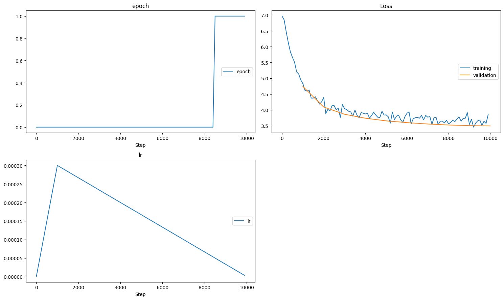

# Transformer-based Anecdote Generator

**Byte-Level BPE · ALiBi · Grouped-Query Attention · SwiGLU · RMSNorm**

## Overview

This project implements a decoder-only Transformer **from scratch in PyTorch**, including both tokenizer and model architecture.

The model is trained for autoregressive text generation (anecdote-style text), and includes several modern architectural components used in contemporary LLMs.

Implemented components:

* Byte-Level BPE tokenizer
* Causal Self-Attention
* Grouped-Query Attention (GQA)
* ALiBi positional bias
* RMSNorm (Pre-Normalization)
* SwiGLU feed-forward layers
* Autoregressive generation loop with temperature and top-k sampling

This project was built as a hands-on deep dive into Transformer internals and modern language model design.

## Architecture

**Model type:** Decoder-only Transformer
**Training objective:** Causal Language Modeling

### Core Components

| Component           | Implementation                            |
| ------------------- | ----------------------------------------- |
| Tokenization        | Byte-Level BPE (implemented from scratch) |
| Attention           | Multi-Head Causal Self-Attention          |
| GQA                 | Separate Q heads and KV heads             |
| Positional Encoding | ALiBi (Attention with Linear Biases)      |
| Normalization       | RMSNorm (pre-norm)                        |
| MLP                 | SwiGLU                                    |
| Generation          | Temperature scaling + top-k sampling      |

## Model Details

* Transformer Layers: `n_layer`
* Hidden Dimension: `hidden_dim`
* Attention Heads: `n_head`
* KV Heads (GQA): `n_kv_head`
* Feedforward Dimension: `intermediate_dim`
* Dropout: `dropout`
* Vocabulary: Byte-level BPE

## Training Setup

* Optimizer: AdamW
* Learning Rate Schedule: Warmup + Linear Decay
* Max Learning Rate: 3e-4
* Total Training Steps: 10,000
* Loss Function: Cross-Entropy
* Training Regime: Teacher forcing (causal LM)

## Training Metrics

Final metrics:

```
Training Loss   : 3.853
Validation Loss : 3.495
```

Observations:

* Stable convergence
* Validation loss slightly lower than training loss (expected due to dropout)
* No strong overfitting
* Learning rate schedule behaved correctly

### Training Curves



## ✨ Example Generation

Example inference:

```
PROMPT: Студент МФТИ на экзамене
OUTPUT: Студент МФТИ на экзамене играть, если я не подумали, что мышел, то он не у него.
```

## Key Implemented Concepts

This project demonstrates understanding and implementation of:

* Byte-level tokenization mechanics
* Incremental BPE merging
* Multi-head attention tensor reshaping
* Grouped-query attention (GQA)
* ALiBi positional bias computation
* Pre-Norm Transformer blocks
* SwiGLU feed-forward layers
* Autoregressive generation loop
* Temperature and top-k sampling
* Masking mechanics (causal + padding)
* Numerical stability in softmax

## What I Learned

* Implementing Transformers from scratch clarifies attention tensor mechanics
* ALiBi removes need for positional embeddings while preserving autoregressive bias
* GQA reduces memory while keeping model capacity
* Careful tensor shape management is critical in attention layers
* Mask ordering and numerical stability are important for training stability

## Possible Improvements

* Weight tying between token embeddings and LM head
* Mixed precision training (FP16 / AMP)
* Perplexity tracking
* Beam search decoding
* Larger dataset scaling
* KV cache for faster inference
* Gradient clipping tuning
